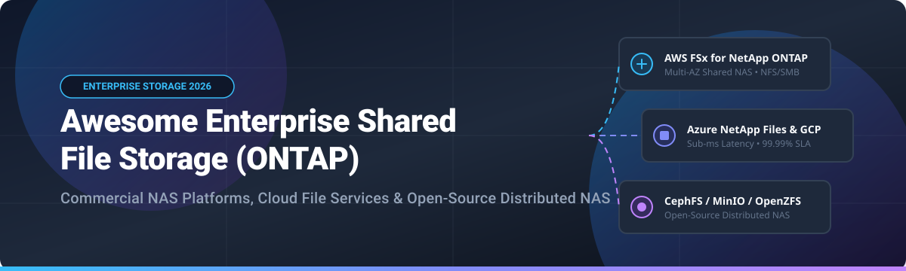

# Awesome-Enterprise-Shared-File-Storage-Ontap

# Awesome-Enterprise-Shared-File-Storage-Ontap 🗄️ 🏢

  

  

  

  

  

  

  

---

## 🌟 Top Enterprise Shared File Storage (ONTAP) Ecosystem

**Curated List of Commercial Enterprise NAS Platforms & Open-Source Distributed File Systems**  

*Focused on Multi-Protocol NAS, Snapshots, Clones, Deduplication, Replication, Hybrid Cloud File Services & Self-Hosted Clustered Storage*

**Last updated: October 2026** 📅

---

### 📌 Overview & SEO Summary

Welcome to the ultimate curated directory of **enterprise shared file storage platforms**, **open-source distributed file systems**, and **software-defined NAS frameworks**. Whether you are looking for enterprise-grade commercial solutions (such as *Amazon FSx for NetApp ONTAP*, *Azure NetApp Files*, and *Nasuni*), or self-hostable open-source alternatives (like *GlusterFS*, *CephFS*, and *NFS-Ganesha*), this list covers category leaders, snapshot technology, and privacy-respecting file storage.

**Key Market Context:**

- **NetApp ONTAP is the dominant enterprise NAS platform** — available natively on AWS, Azure, and Google Cloud, with unified file/block/object support and **industry-leading snapshots and clones**.

- **Amazon FSx for NetApp ONTAP** is the **first-party AWS managed ONTAP service**, offering **SSD and HDD storage**, **multi-AZ high availability**, and **NetApp SnapMirror replication**.

- **Azure NetApp Files** is the **first-party Microsoft managed ONTAP service**, providing **sub-millisecond latency** and **99.99% SLA** for enterprise workloads.

---

## 📑 Table of Contents

- [🏢 SaaS & Commercial Platforms](#-saas--commercial-platforms)

- [🔓 Open-Source GitHub Projects](#-open-source-github-projects)

- [🛠️ How to Contribute](#%EF%B8%8F-how-to-contribute)

- [📊 Star History](#-star-history)

- [🤝 Support & Sponsorship](#-support--sponsorship)

- [⚠️ Disclaimer](#%EF%B8%8F-disclaimer)

---

## 🏢 SaaS / Commercial Platforms

The enterprise shared file storage market spans **first-party cloud NAS services** (Amazon FSx for NetApp ONTAP, Azure NetApp Files, Google Cloud NetApp Volumes) that provide **managed ONTAP with cloud-native integration**, **software-defined NAS platforms** (NetApp Cloud Volumes ONTAP, Pure Storage, Qumulo) that offer **bring-your-own-cloud or on-premises deployment**, and **global file systems** (Nasuni, Panzura, CTERA) that use **object storage as backend with edge caching**. **Amazon FSx for NetApp ONTAP** charges **$0.10/GB-month for SSD** and **$0.025/GB-month for HDD** . **Azure NetApp Files** charges **$0.15/GiB-month for Premium SSD** . **Google Cloud NetApp Volumes** charges **$0.20/GiB-month for Standard tier** .

| SaaS / Commercial Platform | Company / Owner | Valuation / Market Cap | Standard Edition Starting Price | Free Tier / Free Trial Limits | Description |

| :--- | :--- | :--- | :--- | :--- | :--- |

| **[Amazon FSx for NetApp ONTAP](https://aws.amazon.com/fsx/netapp-ontap/)** ☁️ | Amazon | ~$2.0 Trillion | **$0.10/GB-month** (SSD); **$0.025/GB-month** (HDD)  | **Free tier: limited** | **AWS-native managed ONTAP** — **First-party AWS service** . **Multi-AZ high availability** with **automatic failover** . **NetApp SnapMirror replication** . **Supports NFS, SMB, and iSCSI** . **Snapshots, clones, and deduplication** . |

| **[NetApp Cloud Volumes ONTAP](https://cloud.netapp.com/)** 🔵 | NetApp | ~$20 Billion | **Edge Cache: $0.030/GB-month**; **Standard: $0.066/GB-month**; **Premium: $0.132/GB-month**  | **30-day free trial**  | **Software-defined ONTAP in the cloud** — **Full ONTAP feature set**: snapshots, cloning, deduplication, compression, tiering . **Multi-cloud** (AWS, Azure, GCP) . **Add-ons**: Ransomware Protection, Cloud Data Sense, WORM, Cloud Backup . |

| **[Azure NetApp Files](https://azure.microsoft.com/en-us/products/netapp-files/)** 🔷 | Microsoft | ~$3.90 Trillion | **$0.15/GiB-month** (Premium SSD)  | **Free tier: limited**  | **Azure-native managed ONTAP** — **First-party Microsoft service** . **Sub-millisecond latency** and **99.99% SLA** . **Supports NFS, SMB, and dual-protocol** . **Snapshots, clones, and replication** . |

| **[Google Cloud NetApp Volumes](https://cloud.google.com/netapp-volumes)** 🌐 | Google (Alphabet) | ~$2.0 Trillion | **$0.20/GiB-month** (Standard); **$0.30/GiB-month** (Premium)  | **$300 free credits** for new customers  | **GCP-native managed ONTAP** — **First-party Google Cloud service** . **Supports NFS, SMB, and dual-protocol** . **Snapshots, clones, and replication** . **Deep integration with GKE and Compute Engine** . |

| **[Pure Storage Cloud Block Store](https://www.purestorage.com/products/cloud-block-store.html)** 🟣 | Pure Storage | ~$15 Billion | **Custom enterprise pricing**  | **Free trial available** | **Enterprise SAN in the cloud** — **Brings Pure's Purity operating system to AWS and Azure** . **Workload portability** between on-premises and cloud . **Evergreen//One** unified subscription across on-prem, hosted, and public cloud . |

| **[Qumulo Core Cloud](https://qumulo.com/)** 📊 | Qumulo | Private | **AWS PAYG: $0.0263/TB-hour ($19.23/TB-month)**; **AWS 12-month: $15.38/TB-month**  | **Trial available** | **Cloud-native scale-out file storage** — **Petabyte-scale** with **real-time analytics** on file data . **API-first** architecture . **50% cheaper than competing solutions** claimed . |

| **[Dell PowerScale Cloud](https://www.dell.com/en-us/dt/storage/powerscale.htm)** 🔷 | Dell Technologies | ~$60 Billion | **Custom enterprise pricing**  | **Demo available** | **Enterprise NAS in the cloud** — **OneFS operating system** . **Scales to 100+ PB** . **Multi-protocol support (NFS, SMB, HDFS, S3)** . |

| **[Nasuni](https://www.nasuni.com/)** 🟢 | Nasuni | Private | **Subscription based on managed data volume** — all-inclusive  | **Demo available** | **Global file system** — **Unlimited file storage** with object storage backend . **Caching edge appliances** for local performance . **Snapshot-based versioning** with unlimited retention . |

| **[Panzura CloudFS](https://panzura.com/)** 🦅 | Panzura | Private | **CloudFS NAS: $70/month ($840/year) per TB**; **Collaboration: $93.42/month ($1,121/year) per TB**  | **TCO calculator available**  | **Global file system with 60-second RPO** — **Immutable snapshots every 60 seconds** . **AI-powered ransomware protection** . **70% data reduction** via global deduplication . |

| **[CTERA](https://www.ctera.com/)** 🏢 | CTERA | Private | **From $12,000/year**  | **Free trial available** | **Edge-to-cloud global file system** — **Caching edge filers** for remote offices . **Source-based deduplication and compression** (up to 90% reduction) . **Military-grade security** (FIPS 140-2, CAC/PIV, zero-trust) . |

---

## 🔓 Open-Source GitHub Projects

*Sorted by GitHub_Stars_Count (Descending)* 🌟

- **[GlusterFS](https://github.com/gluster/glusterfs)**   

  **Distributed file system capable of scaling to several petabytes**, GPL-2.0 / LGPL-3.0 licensed. **Aggregates storage bricks over TCP/IP into one large parallel network file system** . **Access via FUSE, NFS (v3, v4, v4.1/pNFS, v4.2), SMB, libgfapi, REST/HTTP, HDFS** . **nfs-ganesha integration** provides NFSv4 server capability. **The most widely deployed open-source scale-out NAS solution** — production-proven at petabyte scale . 🧱

- **[Ceph](https://github.com/ceph/ceph)**   

  **Unified distributed storage system (object, block, file)**, LGPL-2.1 / GPL-2.0 / BSD-3-Clause licensed. **CephFS** provides POSIX-compliant distributed file system. **RADOS** is the foundational object store. **Erasure coding** for cost-efficient storage. **The dominant open-source storage platform** for cloud infrastructure and Kubernetes (via Rook). 🐙

- **[NFS-Ganesha](https://github.com/nfs-ganesha/nfs-ganesha)**   

  **User-space NFS server supporting v3, v4, v4.1, v4.2**, LGPL-3.0 licensed. **The reference NFS server for GlusterFS and CephFS** . **FSAL (File System Abstraction Layer)** architecture enables pluggable backends. **Multi-protocol support** (NFS, SMB, 9P). **The building block for clustered NAS solutions** . 🎯

- **[MooseFS](https://github.com/moosefs/moosefs)**   

  **Petabyte-scale distributed file system**, GPL-3.0 licensed. **Fault-tolerant, highly performing, scalable network distributed storage** . **POSIX-compliant**. **Metadata server with multiple chunkservers** . **Snapshot and replication support** . **Used in production for large-scale media and backup workloads** . 📦

- **[LizardFS](https://github.com/lizardfs/lizardfs)**   

  **Open-source distributed file system**, GPL-3.0 licensed. **MooseFS fork** with additional features. **POSIX-compliant** . **Fault-tolerant with replication** . **Web-based management interface** . 🦎

- **[Ceph CSI](https://github.com/ceph/ceph-csi)**   

  **Container Storage Interface driver for Ceph**, Apache-2.0 licensed. **Enables Kubernetes to provision Ceph RBD and CephFS volumes** . **Dynamic provisioning, snapshots, and cloning** . **The standard way to use Ceph storage in Kubernetes** . ☸️

- **[Rook](https://github.com/rook/rook)**   

  **Storage orchestrator for Kubernetes**, Apache-2.0 licensed. **CNCF graduated project** . **Deploys and manages Ceph, Cassandra, NFS, and other storage systems** on Kubernetes . **CephFS and NFS-ganesha operators** for distributed file storage . **Self-managing, self-scaling, self-healing** storage infrastructure . 🎛️

- **[SeaweedFS](https://github.com/seaweedfs/seaweedfs)**   

  **Fast distributed storage system for blobs, objects, files, and data lake**, Apache-2.0 licensed. **Millions of files** supported . **Filer with POSIX-compliant mount** . **S3-compatible API** . **Cloud tiering to S3, GCS, and Azure** . **The most scalable open-source file and object store** for modern workloads . 🌿

- **[Longhorn](https://github.com/longhorn/longhorn)**   

  **Cloud-native distributed block storage for Kubernetes**, Apache-2.0 licensed. **100% open source, run anywhere** . **Built-in incremental snapshots and backups** . **Cross-cluster disaster recovery** . **Native virtual workload storage backend** for KubeVirt and Harvester . 🐂

- **[MinIO](https://github.com/minio/minio)**   

  **High-performance S3-compatible object storage**, AGPL-3.0 licensed. **45K+ GitHub stars** — **the standard self-hosted S3 replacement** . **Ideal as a file storage backend** for global file systems . **Erasure coding, encryption, and versioning** . 🎯

- **[OpenZFS](https://github.com/openzfs/zfs)**   

  **Advanced file system and volume manager**, CDDL-1.0 licensed. **11K+ GitHub stars** — **data integrity, snapshots, and replication** . **`zfs send` and `zfs receive` for efficient replication** . **The most robust open-source file system for NAS** . 🗄️

- **[TrueNAS](https://github.com/truenas/truenas)**   

  **Open-source storage OS with NAS capabilities**, BSD-2-Clause licensed. **Built on OpenZFS** with **NFS, SMB, and iSCSI** support . **Snapshot, replication, and deduplication** . **The most complete open-source NAS platform** . 🏠

---

## 🛠️ How to Contribute

Contributions are welcome! Follow these steps to submit new enterprise file storage platforms or open-source distributed file system software:

1. 🍴 **Fork** the repository.

2. 📝 **Add/edit** entries in `README.md` maintaining table/list structure and formatting.

3. 🔗 Include project title, official website/GitHub link, exact Stars_Count, license, and brief description.

4. 🚀 Submit a **Pull Request** with a descriptive summary of your changes.

---

## 📊 Star History

---

## 🤝 Support & Sponsorship

If you find this enterprise shared file storage repository useful, please consider supporting the project:

- ⭐ **Star** this repository to increase visibility!

- 🔀 **Fork** and share with fellow storage engineers, cloud architects, and open-source advocates.

- ☕ **Sponsor & Buy Me a Coffee**: Support ongoing open-source curation via the [GitHub Sponsor Dashboard](https://github.com/sponsors/ishandutta2007).

---

## ⚠️ Disclaimer

- This is a **community-curated** list — not exhaustive and not an endorsement. ℹ️

- **Amazon FSx for NetApp ONTAP charges $0.10/GB-month for SSD** and **$0.025/GB-month for HDD** . **Azure NetApp Files charges $0.15/GiB-month for Premium SSD** . **Google Cloud NetApp Volumes charges $0.20/GiB-month for Standard** .

- **NetApp Cloud Volumes ONTAP add-on services add up quickly**: **Ransomware Protection $0.009/GB**, **Cloud Data Sense $0.0425/GB**, **WORM $0.018/GB**, **Cloud Backup $0.0425/GB** — plus **$0.001/10K reads** and **$0.01/10K writes** .

- **Open-source file storage tools (GlusterFS, CephFS, MooseFS) are not turnkey** — they require **deployment, cluster configuration, and ongoing maintenance** . **GlusterFS requires bricks and volumes configuration** . **CephFS requires MON, OSD, and MDS daemons** . **Always validate performance and failover with a proof-of-concept** before production deployment . 🗄️

---

  <b>Made with ❤️ for storage engineers, cloud architects, and open-source file storage advocates.</b>

